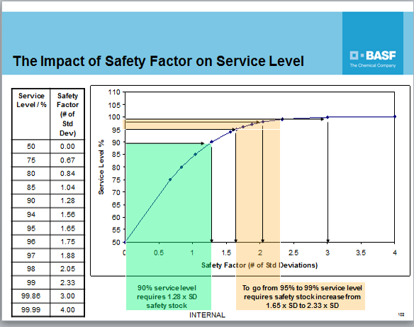

```{r setup, include=FALSE}
knitr::opts_chunk$set(echo = FALSE,eval =TRUE, message =FALSE, warning =FALSE)
```


```{r library}
## library package
library(tidyverse)
library(fpp3)
library(readxl)
library(janitor)
library(plotly)
library(DT)
library(zoo)
library(knitr)
library(htmltools)
library(kableExtra)
```

<div style="border-top: 1px solid #888888; margin: 20px 0;"></div>

## 🔍 Data briefing
The spreadsheet elucidates the procedural intricacies of the existing decision model employed in demand forecasting, encompassing ABC-XYZ analysis and the establishment of safety stock parameters with the support of three different category of pseudo example.


```{r read_data}

## read_excel
ames_production<-read_excel("data/move_out_data.xlsx")%>% clean_names()

## Data wrangling
ames_production_long<-ames_production %>%
  pivot_longer(m_12:m_1,
               names_to  = "date",
               values_to ="quantity") %>% ##convert to long format
  mutate(
    date =as.numeric(str_remove(date,"m_")),
          date = floor_date(Sys.Date(), "months") - months(date),
          date= yearmonth(date) ) 
```


## 📈 Historical pattern

Upon  Figure \@ref(fig:historicaltrend) analysis of the 12-month historical demand data(Square-root transformation to reduce heteroscedasticity) , discernible patterns emerge that we may notice:

**Example 1**: A bimodal distribution with two prominent peaks(*Jun* and *Nov*)

**Example 2**: a  relative flatter line with less fluctuation by seasonality, with gradual decline since 2023 Jun.

**Example 3**: Seasonal product, no demand in warm weather
<br>
<br>
```{r historicaltrend, fig.cap="The last 12 month  of Square Root Transformed [move-out quantity]" }
plot_history<-  ames_production_long %>%
  ggplot(aes(x= date,
             y = sqrt(quantity) ,
             color = description))+
  geom_line( size =1)+ 
  geom_point( color ="black",
              aes(fill = description)) +
  theme_bw() +
  labs(y =" Move-out quantity", y = "Date", 
       color ="Product", fill ="Product", title ="The last 12 month  of Square Root Transformed [move-out quantity]" ) ## Change the label
  
ggplotly(plot_history)%>% 
          layout(
            hovermode = "closest",
            hoverlabel = list(bgcolor = "white"),
            hoverinfo = "text+y",
            xaxis = list(spikemode = 'across')) ##Add hover line
```


##  💡 demand forecasting

### 🎯 Model introduction 
There have two common models in forecasting scope:

1. The **ETS model** is a time series forecasting method used to model and predict data patterns by capturing the quantified index of three components: error (random fluctuations), trend (long-term movement), and seasonality (repeating patterns at fixed intervals).

2. **ARIMA model** (AutoRegressive Integrated Moving Average) is a time series forecasting model that combines **autoregressive** (AR,the number of lag observations) and **moving average** (MA,  the number of lagged forecast errors ) components along with **differencing**($d$,the number of times differencing) to handle non-stationary data.  ARIMA is widely used for analyzing and predicting time series data by capturing patterns, trends, and seasonality in the temporal sequence. The formula is:

$$Y_t =μ+ϕ_1Y_{t−1} +ϕ_2Y_{t−2} +... ϕ_pY_t−p +θ_1ϵ_{t-1}+θ_2ϵ_{t-2}+...+ϵ_t$$
3. **Difference**: It is a commonly held myth that ARIMA models are more general than exponential smoothing.While linear exponential smoothing models are all special cases of ARIMA models, the non-linear exponential smoothing models have no equivalent ARIMA counterparts. On the other hand, there are also many ARIMA models that have no exponential smoothing counterparts. In particular, all ETS models are non-stationary, while some ARIMA models are stationary. More reference on [fpp textbook](https://otexts.com/fpp2/)

### 🎯Example studying for product 1

**ETS model decomposition**

The breakdown ETS model  Figure \@ref(fig:ETScomponent)  indicate it failed to capture the seasonality and the slope of repetitive trend. In turn, it became a **piecewise linear model**  structured by 
1)`level`:the baseline or average value of the time series, and
2）`remainder`: the white noise or residual for the model fitting, which  persisting at **high levels**.
```{r tsibble}
## Convert to tsibble(temporal data frame)
ames_production_ts<- as_tsibble(ames_production_long, key = c("description","material_type"), index =date)

Example_1<-ames_production_ts %>% filter(description =="EXAMPLE 1")

Example_2<-ames_production_ts %>% filter(description =="EXAMPLE 2")

Example_3<-ames_production_ts %>% filter(description =="EXAMPLE 3")
```


```{r ETScomponent, fig.cap="The breakdown of ETS analysis"}
model_ETS<- Example_1  |>
  model(ETS(quantity)) 
 
 components(model_ETS) |>
    autoplot() +theme_bw() +
 theme(strip.background = element_rect(fill = "#90EE90"),
 strip.text.x = element_text(size = 12, 
 face ="bold")) 
```


**ARIMA model decomposition**

The arima model demonstrates a marginal improvement compared to Model B in terms of performance but the prediction still  fall into the logarithm distribution since the insufficient lag and `high degree of freedom` provided.


```{r arimamodel1,eval=FALSE }
## Not run code
model_ARIMA_exp1<-Example_1 %>%  model(ARIMA(quantity)) 
## Not run code
  forecast_model_exp1<- model_ARIMA_exp1 |>
  forecast(h = 6) 

forecast_data_exp1<-  as.tibble( forecast_model_exp1) %>% rename( model =quantity,
                                                        quantity=.mean) %>% 
  mutate( model =as.character(model),
          var =as.numeric(str_extract(model , "(?<=,\\s)\\d+\\.?\\d*(?:[eE][-+]?\\d+)?")),
          sigma =sqrt(var),
          low80 = quantity- 1.282 *sigma,
          high80 = quantity+ 1.282 *sigma,
          low90 = quantity- 1.645*sigma,
          high90 = quantity+ 1.645 *sigma
          )


data_bind_exp_1<- rbind(forecast_data_exp1 %>% select(description, material_type, date, quantity) ,ames_production_long %>% filter(description =="EXAMPLE 1")  )


```


```{r forecast1, eval=FALSE}

## Not run code
forecast_exp1<- ggplot(data = forecast_data_exp1) +
  geom_line( data = data_bind_exp_1, 
             aes(x = date,y= quantity), 
             color ="black") + 
  geom_ribbon( aes(x = date, 
                   ymin =low80, 
                   ymax =high80), 
               fill = "blue",alpha =0.3) +
  geom_ribbon(aes(x = date, 
                  ymin =low90, ymax =high90),
              fill = "#82CAFF",alpha =0.3)+ 
  geom_line(aes(x = date, y= quantity),
            color ="red")+
  theme_bw() +
  annotate("text", x= yearmonth("2024-07"), 
           y = c(20000, 36000), 
           label =c("80%CI", "90%CI"))+
  labs(x="Date", y="Move-out quantity",
       title = "6 months forecast of product by Arima(1,0,0) model")

ggplotly(forecast_exp1)
```
```{r formula_detect}
##Not run code
  ## Convert to a serial of temporal object
ts_data <- ts(Example_1$quantity, frequency = 30)

## Set up the start date
start_date<- as.Date("2024-03-01")

## model fitting and forecast
ts_forecast_exp1 <- ts_data %>% forecast::auto.arima() %>% 
  forecast(h =6) %>%
  as.tibble() %>% 
  mutate(date = yearmonth(seq(start_date, by = "1 month", length.out = 6))) %>% rename( quantity=`Point Forecast`)

ts_forecast_exp1$description<-"Example_1"
ts_forecast_exp1$material_type<-"own manufactured product"

ts_bind_exp1<- rbind( as.tibble(Example_1),ts_forecast_exp1  %>% 
         select(date,description,material_type,quantity))


forecast_exp1_auto <- ggplot(data = ts_forecast_exp1) +
  geom_line( data =ts_bind_exp1 , 
             aes(x = date,y= quantity), 
             color ="black") + 
  geom_ribbon( aes(x = date, 
                   ymin =`Lo 80`, 
                   ymax =`Hi 80`), 
               fill = "blue",alpha =0.3) + 
   geom_ribbon(aes(x =date, ymin =`Lo 95`, 
                   ymax =`Hi 95`),
              fill = "#82CAFF",alpha =0.3)+
  geom_line(aes(x = date, y= quantity),
            color ="red")+
                   
  theme_bw() +
  annotate("text", x= yearmonth("2024-07"), 
           y = c(20000, 40000), 
           label =c("80%CI", "95%CI"))+
  labs(x="Date", y="Move-out quantity",
       title = paste(6,"months forecast of product by Arima(1,0,0) model"))


 ggplotly(forecast_exp1_auto)

```


## 🧭 ABC-XYZ Analysis

In the structure of the ABC-XYZ Analysis, it is noteworthy that the ABC category, delineating the value and revenue contribution, is anticipated to exhibit stability. Meanwhile, prudent consideration should be given to the XYZ category, taking into account the principles of nil demand months and coefficient variability:

**X** articles have demand coefficent variability < 0.5
**Y** articles have demand coefficent variability between 0.5 and 1.0
**Z** articles have demand coefficient variabilty > 1.0
**Z2** articles are those Z articles with 6 months or more with zero demand history
<br>
<br>


```{r rollXYZ}

zero_count<- function(x){
  
  sum(str_detect(x, "^0$")==TRUE)}
    
modelbind<- ts_bind_exp1  %>% mutate(rollmean=rollmean(quantity,6, fill =NA,align ="right"),
                        rollsd= rollapply(quantity, 6,sd, fill =NA,align ="right"),
                        rollCV =round(rollsd/rollmean, digits =2),
                        `zero month` = rollapply( quantity, 12,zero_count ,fill =NA,align ="right"),
                        XYZ = case_when( 
                         rollCV <=0.5 ~ "X", 
                          rollCV> 0.5 & rollCV<=1 ~ "Y",
                        rollCV > 1 & `zero month`<= 6 ~ "Z",
                         rollCV > 1 & `zero month` > 6 ~ "Z2",
                        is.na(rollCV)~"NA"),
                        quantity=round(quantity, digits =2))


```

Below Table \@ref(tab:kable1) shows the result of XYZ  identification for example 1 forecasting:
```{r kable1}
modelbind %>%select(date, quantity,rollmean,rollsd, rollCV,`zero month`, XYZ) %>%
  tail() %>% kable(align = "c",
        booktabs = TRUE,
        caption = "The XYZ prediction for Example 1 forecast")%>%
kable_styling(full_width = FALSE,latex_options = "hold_position", 
row_label_position='c', 
position='center') %>%
kable_paper(full_width = FALSE) 
```


## 🌏 Safety stock
Once the XYZ category is identified, we can proceed to the next phase to establish safety stock. Here are the key principles:

1.Statistical safety stocks can only be used reliably where the demand volatility is low (ie X or Y articles). Statistical safety stocks should not be used for Z / Z2 articles.

2.A target of 95% is usually adequate for finished goods. The correlation of target service level and safety factor can be explained  as:
<br>
<br>
```{r safetyfactor, caption ="he correlation of target service level and safety factor"}

```

3. For `own manufactured product`, the lead time will be 10 days, for  `merchandise`outsourcing, it usually took 45 days.

Let's assume the target of `example 1` will maintain **95%**. Thus, the safety stock correlation shall be 1.65.
```{r}
modelbind<- modelbind %>% mutate(replenishment_lt =
  case_when( material_type == "own manufactured product"~"10",
             material_type == "merchandise"~"45",
             is.na(material_type)~NA,
             .default = "Unknown"),
             replenishment_lt =as.numeric(replenishment_lt),
              TSL = "95%",
              `safety factor` =
  case_when( TSL =="95%"~1.65,
             TSL =="50%"~0,
              TSL =="75%"~0.67,
              TSL =="80%"~0.84,
              TSL =="94%"~1.56,
              TSL =="96%"~1.75,
              TSL=="97%"~1.88,
             TSL =="99%" ~2.33,
             TSL =="98%" ~2.05,
             TSL =="99.99%" ~4,
            is.na(material_type)~NA ),
             demand_lt = rollmean/30*replenishment_lt,
             lt_correction = round(sqrt(replenishment_lt/30), digits =2),
              `safety stock` =  round(rollsd*lt_correction*`safety factor`,digits = 2),
               `safety stock`=if_else( XYZ %in%c("Z", "Z2"),"No SS",as.character(`safety stock`)),
                    `safety stock`= as.numeric(   `safety stock`)      
              )
```
Below Table \@ref(tab:kable1) shows the result of statistical safety stock  for example 1 forecasting:
```{r kable2}
modelbind %>% select(description, replenishment_lt, `safety factor`, demand_lt, `safety stock`) %>%
  tail() %>% kable(align = "c",
        booktabs = TRUE,
        caption = "The statistical safety stock for Example 1 forecast")%>%
kable_styling(full_width = FALSE,latex_options = "hold_position", 
row_label_position='c', 
position='center') %>%
kable_paper(full_width = FALSE) 
```


## 📜 Following up
1.  More visibility in  sales data :  extended timeframe(3-5 years?) regional breakdown?

2. Missing  information of other division: dimension information --- volumetric weight vs actual weight? network capacity?

3. The understanding of abbreviation in spreadsheet

4. Convert the data analysis to the interactive shinyapp [Example]( https://loongyuho.shinyapps.io/template_new_energy/)

<br>
<br>
<div style="border-top: 1px solid #c7c8c7; margin: 20px 0;"></div>


```{r}
HTML( '<p style="color =grey; margin-left:10px;"> Version 1.0 | This webpage is licensed by <a href="https://creativecommons.org/licenses/by/3.0/"><i class="fa-brands fa-creative-commons"></i> CC 3.0</a> | Monash AMES project team')
```


